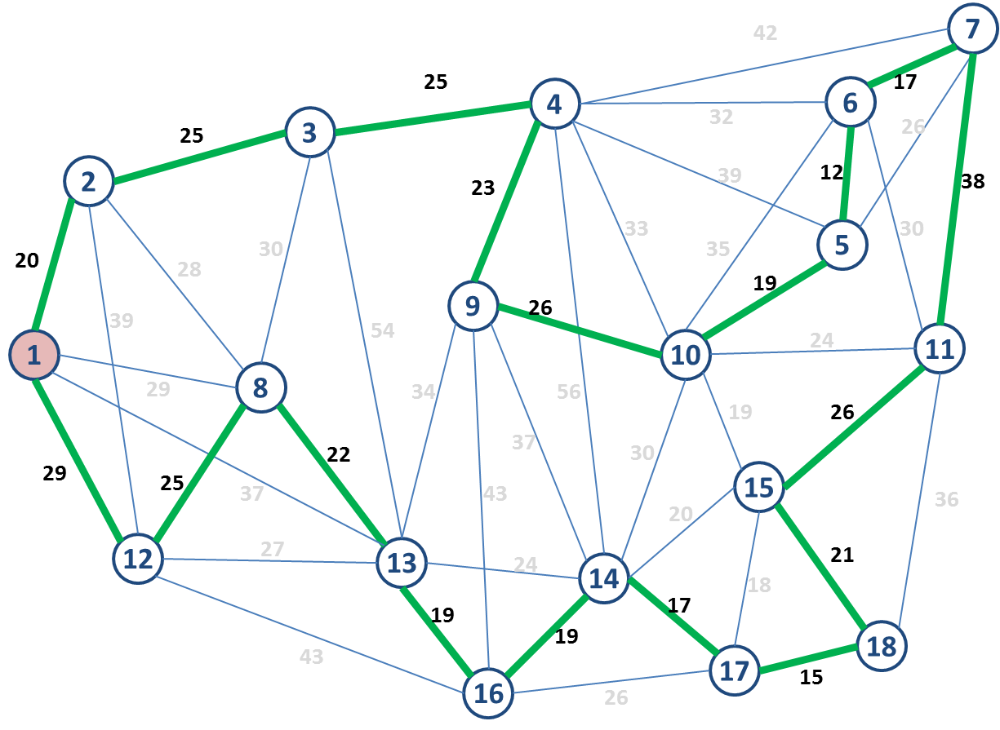

# Problema do Caixeiro Viajante




> O problema do caixeiro-viajante tenta determinar a menor rota para percorrer todos os nós de um grafo conectado, retornando ao nó de origem. Ele é um problema de otimização NP-difícil inspirado na necessidade dos vendedores em realizar entregas em diversos locais no menor tempo possível.

## 📖 Documentação

- [Download do Artigo](Artigo-Problema-do-Caixeiro-Viajante.pdf)
- [Download do Slide - Força Bruta](Slide-Caixeiro-Viajante.pdf)

## 💻 Pré-requisitos

Antes de começar, verifique se você atendeu aos seguintes requisitos:

- [`< NodeJS >`](https://nodejs.org/)

## 🚀 Baixando e Rodando o Projeto

Para instalar e rodar o projeto, siga estas etapas:

```
git clone https://github.com/pumba-dev/travelling-salesman-problem.git

cd travelling-salesman-problem

node travelling-salesman.ts
```

## 🤝 Colaboradores

Agradecemos às seguintes pessoas que contribuíram para este projeto:

<table>
  <tr>
    <td align="center">
      <a href="https://github.com/pumba-dev">
        <br>
        <sub>
          <b>Eu Mesmo</b>
        </sub>
      </a>
    </td>
    <td>
      <a href="https://github.com/DevUnusual">
        <br>
        <sub>
          <b>Carlos Meneses</b>
        </sub>
      </a>
    </td>
    <td>
      <a href="https://github.com/usernamegran">
        <br>
        <sub>
          <b>Gabriel Reis</b>
        </sub>
      </a>
    </td>

  </tr>
</table>

## 😄 Seja um dos Contribuidores<br>

Entre em contato para se tornar um contribuidor.

## 💰 Donate

[](https://picpay.me/pumbadev)

## 📝 Licença

Copyright © 2023 Pumba Developer

[⬆ Voltar ao topo](#)<br>
